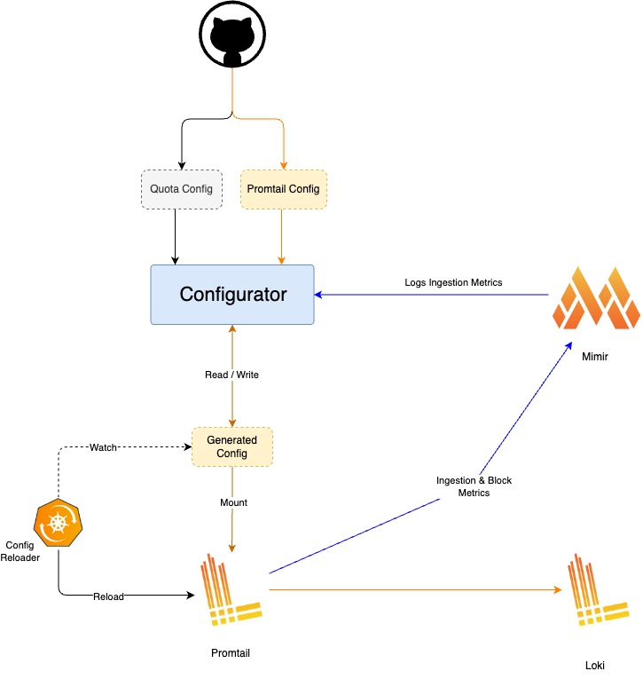

#  Logs TCO Optimizer / Configurator
Manage log ingestion for workloads running in a Kubernetes cluster. By dynamically throttling log shipping for workloads that exceed their allocated daily budget.




## 1. Overview

**Configurator** is a Go application designed to dynamically manage log ingestion budgets for workloads running in a Kubernetes cluster. It monitors log volumes generated by specific applications, compares them against pre-defined daily budgets, and automatically enforces these budgets by modifying the configuration of a Promtail instance.

**Purpose:** To prevent excessive log generation from overwhelming logging infrastructure (like Loki) and incurring unexpected costs, by dynamically throttling log shipping for workloads that exceed their allocated daily budget.

**Core Functionality:**

1.  **Reads Configuration:** Loads main settings from `config.yaml` and budget definitions from `budget.yaml`.
2.  **Monitors Ingestion:** Periodically queries a Mimir instance to get the log volume (in bytes/GB) ingested per workload since the the last execution.
3.  **Compares Budgets:** Compares the fetched ingestion volume against the `daily_ingestion_budget` defined for each workload in `budget.yaml`.
4.  **Enforces Budgets:** If a workload exceeds its budget, Configurator fetches the current Promtail configuration from a specified Kubernetes secret. It then modifies this configuration by adding a `sampling` stage in the Promtail pipeline specifically for the offending workload, effectively throttling log shipping for it.
5.  **Validates & Updates:** Before updating the secret, it validates the modified Promtail configuration using a local Promtail binary (`-check-syntax`). If valid, it updates the Kubernetes secret with the new configuration.
6.  **Resets Budgets:** Runs a daily task (typically at midnight) to remove all the dynamically added `sampling` stages, allowing all workloads to ship logs again for the new day.
7.  **Scheduling:** Uses cron expressions defined in the configuration to schedule the ingestion checks and the daily budget reset.
8.  **Deployment:** Designed to run as a containerized application within the Kubernetes cluster it manages, deployed via a Helm chart.

**Additional Functionality:**

* **Kubernetes Native:** Interacts directly with Kubernetes secrets for configuration management.
* **Dry-Run Mode:** Allows testing the logic without actually modifying Kubernetes secrets.
* **Structured Logging:** Uses `zerolog` for efficient and configurable JSON or console logging.


**Workflow Breakdown:**

1.  **Initialization:**
    * Loads configuration from `config.yaml` (or path specified by `CONFIG_FILE` env var).
    * Loads budget definitions from the path specified in `config.yaml`.
    * Initializes the Kubernetes client (using in-cluster config or a specified kubeconfig file).
    * Initializes the logger based on configuration.
    * Sets up the cron scheduler with the specified timezone.
2.  **Scheduled Tasks:**
    * **`quotaReset` (e.g., daily at midnight):**
        * Queries Mimir for log volume (GB) ingested by monitored workloads within the time range.
        * Compares the ingested volume for each workload against its calculated budget.
        * Identifies workloads exceeding their budget
        * If abusers are found:
            * Fetches the current `promtail.yaml` content from the configured Kubernetes Secret (`internal/kubernetes`).
            * Parses the YAML into a `PromtailConfig` struct (`internal/promtail`).
            * Removes *all* `sampling` stages added by the configurator for budget enforcement.
            * Adds a `sampling` pipeline stage for each abuser workload. It checks if a sampling stage already exists for the workload to prevent duplicates. The sampling rate is calculated based on the excess ingestion ratio.
            * Validates the modified configuration syntax using the Promtail binary specified in `config.yaml`.
            * Marshals the modified `PromtailConfig` back to YAML.
            * Updates the Kubernetes Secret with the new YAML content (respects `dry_run` setting).

        
## 2. Architecture

The Configurator is designed with a modular architecture to efficiently manage log ingestion budgets:

### 2.1 Components

1. **Budget Manager**: Loads and processes budget definitions from `budget.yaml` and provides APIs to access budget information for workloads.
   
2. **Kubernetes Client**: Handles communication with the Kubernetes API to retrieve and update Promtail configuration stored in Kubernetes Secrets.

3. **Mimir Client**: Queries the Mimir/Prometheus endpoint to fetch log ingestion metrics for each monitored workload.

4. **Promtail Config Manager**: Parses, modifies, validates, and serializes Promtail configuration YAML.

5. **Scheduler**: Manages cron jobs for periodic ingestion checks and budget resets based on configured schedules.

6. **Logger**: Provides structured logging capabilities with different formats and verbosity levels.

### 2.2 Data Flow

1. The Scheduler triggers the ingestion check at configured intervals.
2. The ingestion check process retrieves budget definitions using the Budget Manager.
3. The Mimir Client fetches actual log ingestion volumes for monitored workloads.
4. Workloads exceeding their budget are identified.
5. For offending workloads:
   - The Kubernetes Client retrieves the current Promtail configuration from the Kubernetes Secret.
   - The Promtail Config Manager removes all sampling stages added for budget enforcement.
   - The Promtail Config Manager adds sampling stages for offenders with a calculated sampling rate based on the excess ingestion ratio.
   - The modified configuration is validated using the local Promtail binary.
   - If valid, the Kubernetes Client updates the Secret with the new configuration.

### 2.3 Deployment Architecture

The Configurator is designed to run as a single instance within the Kubernetes cluster it manages:

### 2.4 Prerequisites

#### Promtail Configuration Requirements

Before deploying the Configurator, ensure your Promtail configuration generates the necessary metrics that the Configurator relies on to monitor log processing volumes. Add the following metrics configuration to your Promtail scrape configuration:

```yaml
scrape_configs:
  - job_name: kubernetes-pods
    pipeline_stages:
      # -- other pipeline stages --
      - metrics:
          processed_log_bytes_total:
            config:
              action: add
              count_entry_bytes: true
              match_all: true
            description: total number of log lines processed
            max_idle_duration: 24h
            prefix: promtail_custom_
            source: workload
            type: Counter
      # -- other pipeline stages --
```

## 3. Configuration

Configurator uses two main YAML configuration files.

### 3.1. `config.yaml`

This file contains the main operational settings for the Configurator.
It is loaded based on the `CONFIG_FILE` environment variable or defaults to `/app/config/config.yaml` inside the container.


| Parameter                      | Type                 | Required | Default                                                      | Description                                                                                                |
| :----------------------------- | :------------------- | :------- | :----------------------------------------------------------- | :--------------------------------------------------------------------------------------------------------- |
| `cluster`                      | string               | **Yes**  | -                                                            | Name of the Kubernetes cluster being managed. Used in Mimir queries.                                       |
| `promtail.local_bin`           | string               | No       | `/app/promtail`                                              | Path to the Promtail binary used for config validation (`-check-syntax`).                                  |
| `promtail.sampling.selector.format` | string          | No       | `{workload="%s"} |= ""`                                      | Format string for the workload selector in sampling stages.                                                |
| `promtail.secret.name`         | string               | No       | `promtail`                                                   | Name of the Kubernetes Secret containing the Promtail configuration.                                       |
| `promtail.secret.namespace`    | string               | No       | `kube-logging`                                               | Namespace of the Promtail Kubernetes Secret.                                                               |
| `promtail.secret.key`          | string               | No       | `promtail.yaml`                                              | Key within the Secret that holds the Promtail configuration YAML content.                                  |
| `metrics.mimir_endpoint`       | string               | Yes      | -                        | URL of the Mimir (or Prometheus compatible) query endpoint.                                                |
| `metrics.mimir_tenant`         | string               | **Yes**  | -                                                            | Mimir Tenant ID (`X-Scope-OrgID` header value).                                                            |
| `metrics.names`                | map[string]string    | No       | -                                                            | Custom names for Promtail custom metrics if they differ from defaults.                                     |
| `metrics.query_timeout`        | duration string      | No       | `30s`                                                        | Timeout for Mimir queries (e.g., "30s", "1m").                                                             |
| `scheduling.timezone`          | string               | No       | `Asia/Kolkata`                                               | Timezone for the cron scheduler (e.g., "UTC", "America/New_York").                                         |
| `scheduling.cron.budget_reset` | cron string          | No       | `0 0 * * *` (Daily at midnight)                              | Cron expression for running the budget reset.                                                              |
| `budget.config_path`           | string               | No       | `/app/budget/budget.yaml`                                    | Path to the budget definition file.                                                                        |
| `budget.org`                   | string               | **Yes**  | -                                                            | Organization name to filter budgets from `budget.yaml`.                                                    |
| `budget.env`                   | string               | **Yes**  | -                                                            | Environment name to filter budgets from `budget.yaml`.                                                     |
| `budget.multiplier`            | float64              | No       | `1.0`                                                        | Multiplier applied to budget baselines.                                                                    |
| `budget.minimum`               | float64              | No       | `0.5`                                                        | Minimum budget value in GB.                                                                                |
| `log.level`                    | string               | No       | `info`                                                       | Logging level (`trace`, `debug`, `info`, `warn`, `error`, `fatal`, `panic`).                               |
| `log.format`                   | string               | No       | `standard` (in `dev` mode), `json` (in `prod` mode)          | Log output format (`json` or `standard`).                                                                  |
| `mode`                         | string               | No       | `prod`                                                       | Operational mode. `prod` assumes in-cluster config & JSON logs. `dev` requires `kube_config`.              |
| `kube_config`                  | string               | **Yes** (if `mode=dev`) | -                                             | Absolute path to the kubeconfig file (only used if `mode` is `dev`).                                       |
| `dry_run`                      | bool                 | No       | `false`                                                      | If true, performs all actions *except* updating the Kubernetes secret.                                     |


#### Notes:
- Ensure the `promtail.local_bin` path is correct within the running container (`/app/promtail` in the provided Dockerfile).

### 3.2. `budget.yaml`

This file defines the daily log ingestion budget (in GB) for each workload within specific organizations and environments.

```yaml
orgs:
  - name: <organization_name> # e.g., invest
    envs:
      - name: <environment_name> # e.g., stage
        workloads:
          - name: <workload_name_1> # e.g., otel-collector (Matches 'workload' label in Promtail/Loki)
            daily_ingestion_budget: <budget_in_gb_1> # e.g., 30 (Integer)
          - name: <workload_name_2> # e.g., kafka-lag-exporter
            daily_ingestion_budget: <budget_in_gb_2> # e.g., 50
          # ... more workloads
```

- orgs: A list of organizations.
- name (under orgs): The name of the organization. Matches budget.org in config.yaml.
- envs: A list of environments within the organization.
- name (under envs): The name of the environment. Matches budget.env in config.yaml.
- workloads: A list of workloads within the environment.
- name (under workloads): The name of the workload. This MUST match the workload label value attached to logs by Promtail. Configurator uses this name to query Mimir and identify logs to drop.
- daily_ingestion_budget: The maximum allowed daily log ingestion volume in Gigabytes (GB) for this workload. This value is used to compare against actual ingestion metrics from Mimir and determine if throttling should be applied. When a workload exceeds this budget, a sampling stage will be added to the Promtail configuration.


## 4. Usage and Logic

The Configurator operates based on two primary operations:

#### 4.1 Budget Enforcement

When the scheduler triggers an ingestion check (based on the `scheduling.cron.budget_reset` setting):

1. The system queries Mimir for the total log volume ingested by each workload since the beginning of the day.
2. Each workload's ingestion is compared with its calculated budget.
3. If a workload has exceeded its budget, the system:
   - Retrieves the current Promtail configuration
   - Calculate dynamic sampling rate.
   - Adds a dynamic sampling stage like the following to the pipeline:
```yaml
  - match:
      pipeline_name: automated_sampling
      selector: '{workload="<workload_name>"} |= ""'
      stages:
      - sampling:
          rate: <claculated_sampling_rate>
```

4. The modified configuration is validated using the local Promtail binary.
5. If validation passes, the configuration is updated in the Kubernetes secret.

#### 4.2 Budget Reset

When the scheduler triggers a budget reset (based on the `scheduling.cron.budget_reset` setting, typically at midnight):

1. The system retrieves the current Promtail configuration.
2. It removes all sampling stages added by the configurator for budget enforcement.
3. The modified configuration is validated.
4. If validation passes, the configuration is updated, allowing all workloads to start with a clean slate for the new day.

#### 4.3 Viewing Status

To check the status of workloads and their ingestion:
- <dashboard_links>
- Analytics


### 5. Development
- Prerequisites:
  - Go >= 1.24
  - Docker
  - Helm
  - Access to a Kubernetes cluster
  - Access to Mimir/Prometheus
  - Promtail binary
- Dependencies: `go mod download`
- Build: `go build -o configurator .`
- Test: `go test ./...` (Unit tests are present for budget, kubernetes, mimir, promtail modules).
- Run Locally (Dev):
  - Configure `config/config.yaml`: Set `mode: dev`, provide `kube_config` path, adjust other settings like Mimir endpoint/tenant, Promtail secret details (can point to a local test secret if needed), set `promtail.local_bin` to your local Promtail path.
  - Configure `config/budget.yaml`.
  - Run using `docker-compose up` --build or directly go run main.go